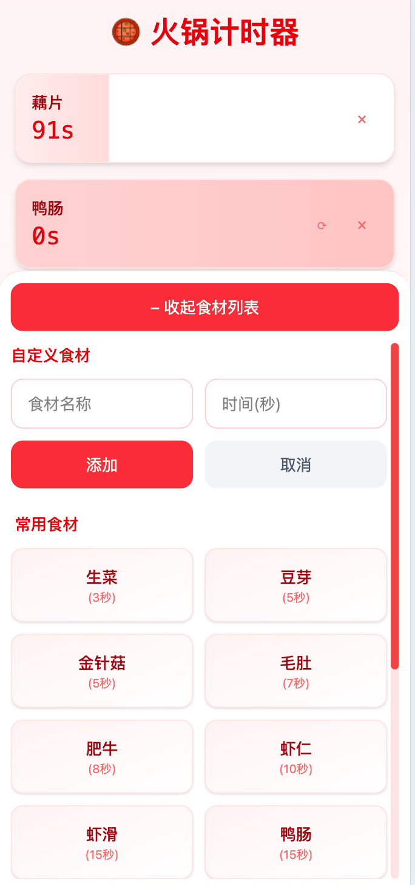

# 火锅倒计时

一个简单实用的火锅食材计时器，帮助你完美把控火锅食材的烹饪时间！

## 📱 预览

<div align="center">
  
</div>

## ✨ 功能特点

- 🍖 预设常见火锅食材的建议烹饪时间
- ⏰ 多个食材同时计时
- 🔔 计时完成震动提醒
- 📝 支持自定义食材和时间
- 💫 流畅的动画效果
- 📱 移动端优先的响应式设计

## 🛠️ 技术栈

- React + TypeScript
- Vite
- TailwindCSS
- Framer Motion
- Zustand

## 📦 安装

```bash
# 克隆项目
git clone https://github.com/zhou-zzz/hot-pot-countdown.git

# 安装依赖
pnpm install

# 启动开发服务器
pnpm run dev
